# Arcanum

**A desktop worldbuilding studio for writers, game designers, and hobbyist creators.**

Arcanum is where you build a world — its lore, maps, characters, timeline, factions, art, and any of the rules that hold it together — and then publish it as a public website with one click. It works just as well for a tabletop campaign setting, a novel series bible, or a full MUD game world.

Arcanum started as the creator tool for [AmbonMUD](https://github.com/jnoecker/AmbonMUD), and still includes everything needed to design and balance a complete text-based game. But its worldbuilding side works for any setting.

## Download

Grab the latest installer for Windows, macOS, or Linux from the **[releases page](https://github.com/jnoecker/AmbonArcanum/releases)**.

Two editions are available for each release:

- **Full Edition** — everything, including AI art generation, LLM-assisted writing, and vision-based map analysis.
- **Community Edition** — the same worldbuilding, zone, and design tools without any AI features. No API keys needed.

No account is required for either edition. If you don't want to manage AI provider accounts yourself, you can sign into the optional [Arcanum Hub](#arcanum-hub) to route everything through a single key.

## Screenshots

  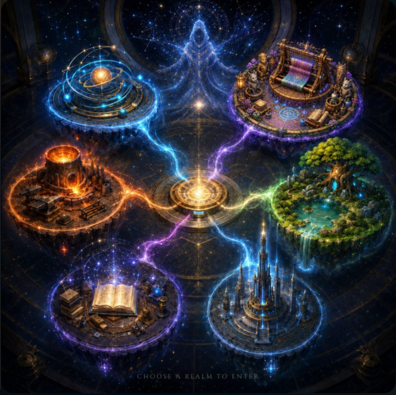
   
  <em>The world map — each floating island is a major feature area you can step into</em>

<table>
  <tr>
    <td align="center" width="33%">
      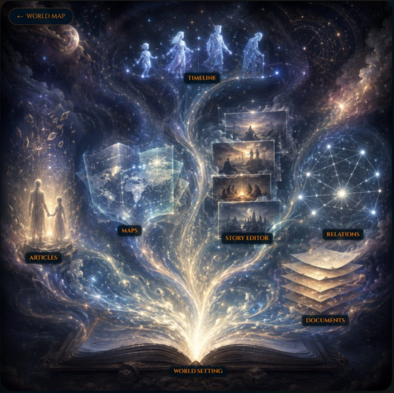 
      <strong>The Arcanum</strong> 
      Articles, maps, timeline, relations, story editor
    </td>
    <td align="center" width="33%">
      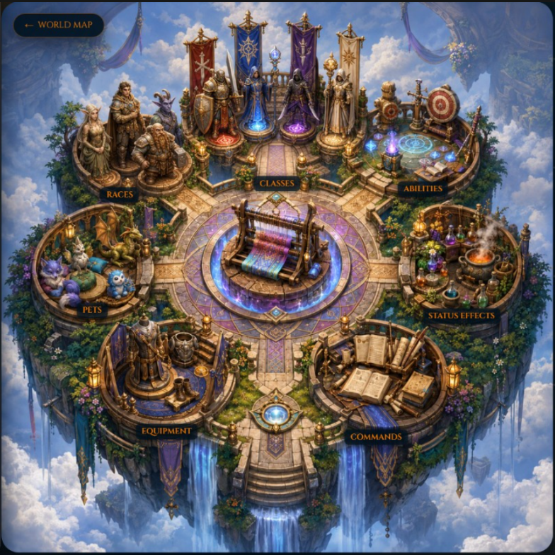 
      <strong>The Loom</strong> 
      Classes, races, abilities, stats, equipment
    </td>
    <td align="center" width="33%">
      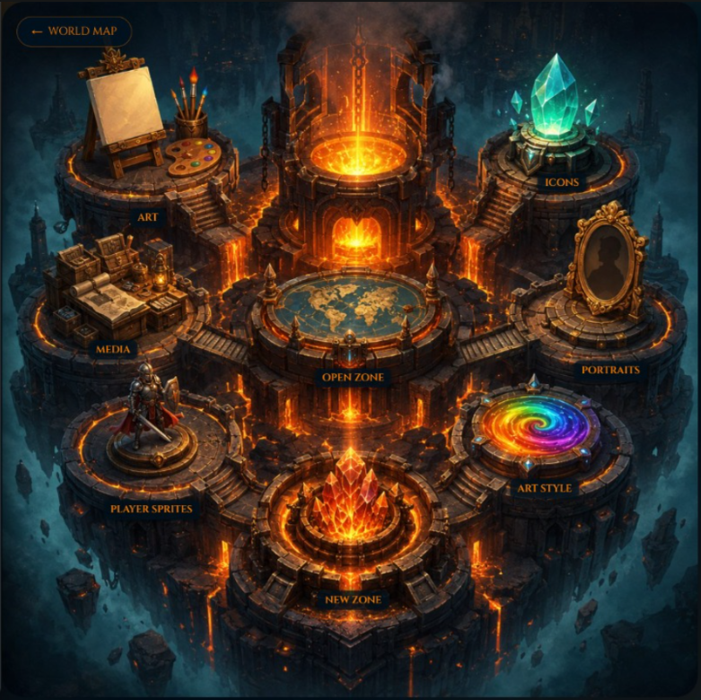 
      <strong>The Forge</strong> 
      AI art generation, portraits, icons, sprites
    </td>
  </tr>
  <tr>
    <td align="center">
      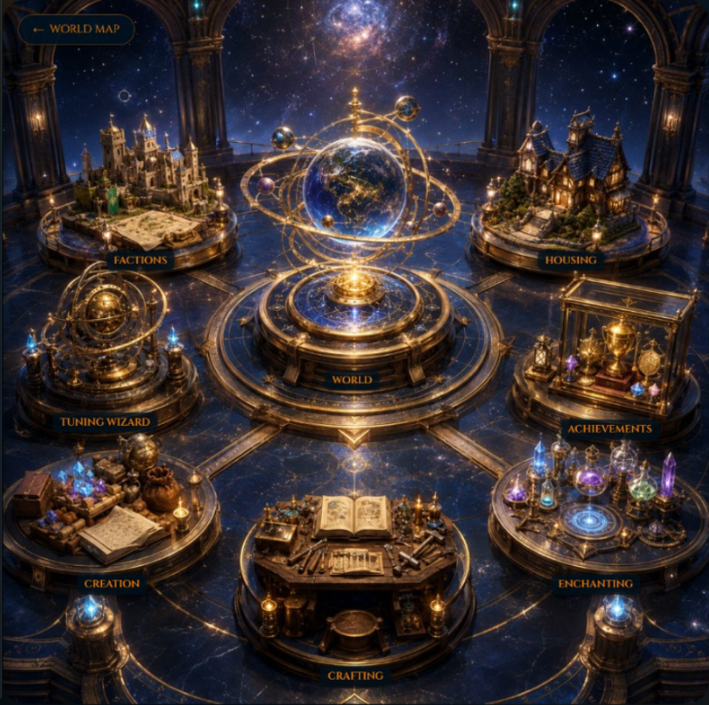 
      <strong>The Orrery</strong> 
      Economy, crafting, housing, factions, tuning
    </td>
    <td align="center">
      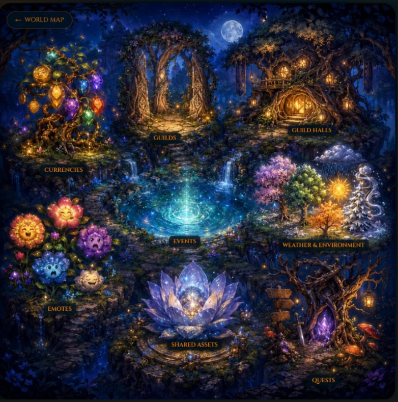 
      <strong>The Living World</strong> 
      Events, emotes, gardening, mounts, nature
    </td>
    <td align="center">
      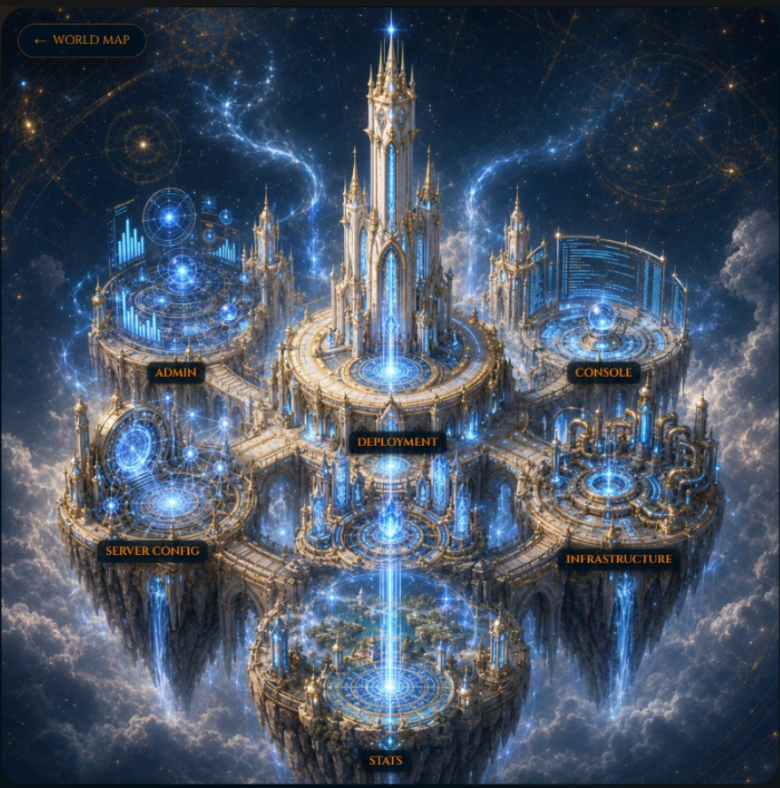 
      <strong>The Spire</strong> 
      Server control, deployment, admin, settings
    </td>
  </tr>
</table>

  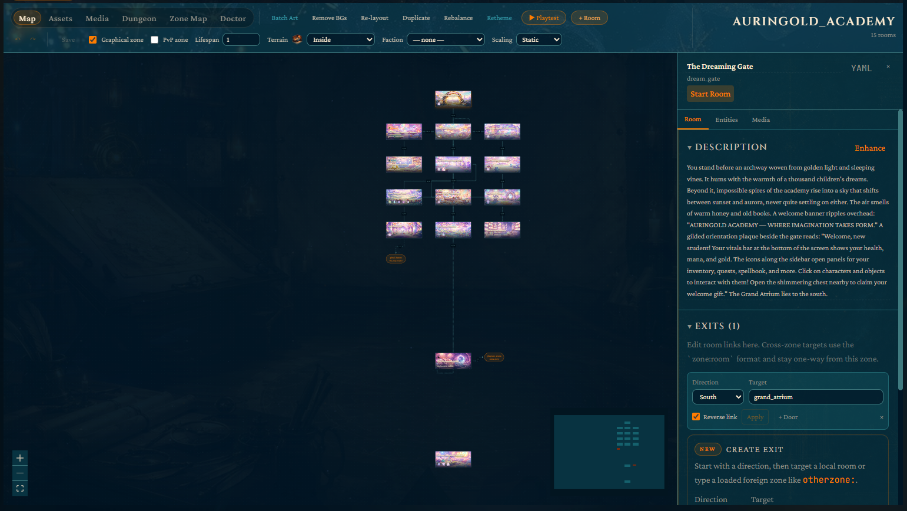 
  <em>Zone map editor — room graph with AI-generated backgrounds, entity sprites, and exit handles</em>

  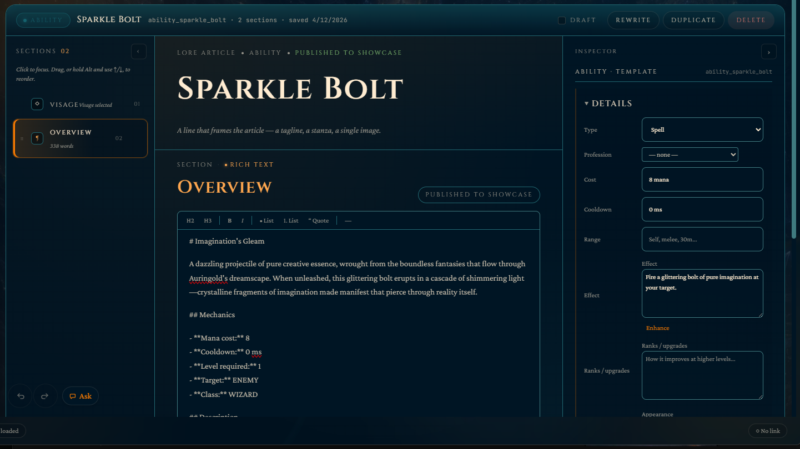 
  <em>Article editor — template fields, rich text with @mentions, and AI rewrite tools</em>

<table>
  <tr>
    <td align="center" width="33%">
      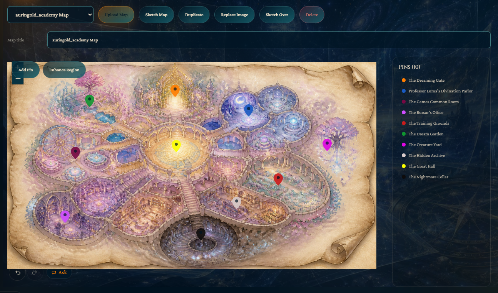 
      <strong>Interactive Maps</strong> 
      Colored pins linked to lore articles, AI analysis
    </td>
    <td align="center" width="33%">
      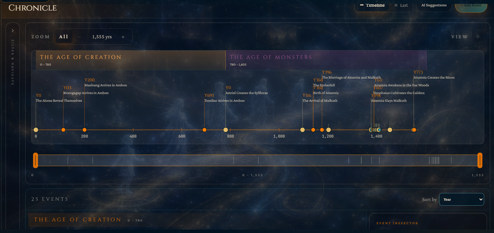 
      <strong>Timeline</strong> 
      Eras, importance-weighted events, AI inference
    </td>
    <td align="center" width="33%">
      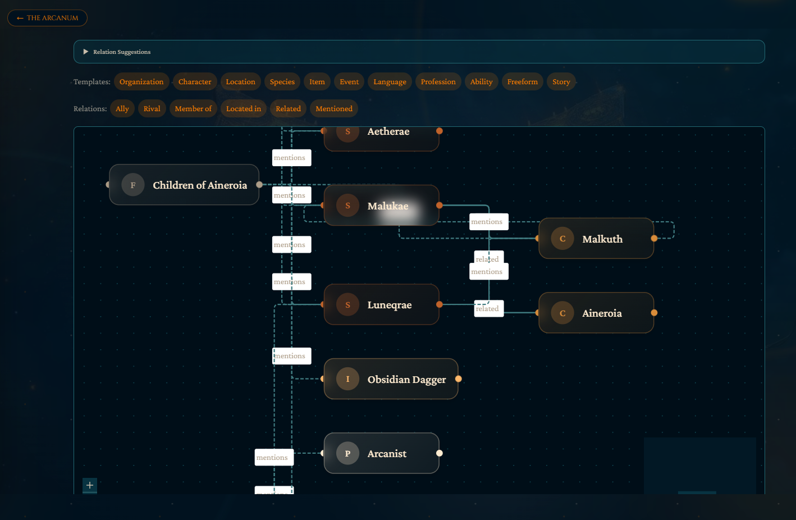 
      <strong>Relationship Graph</strong> 
      Connections between articles with template and type filters
    </td>
  </tr>
</table>

  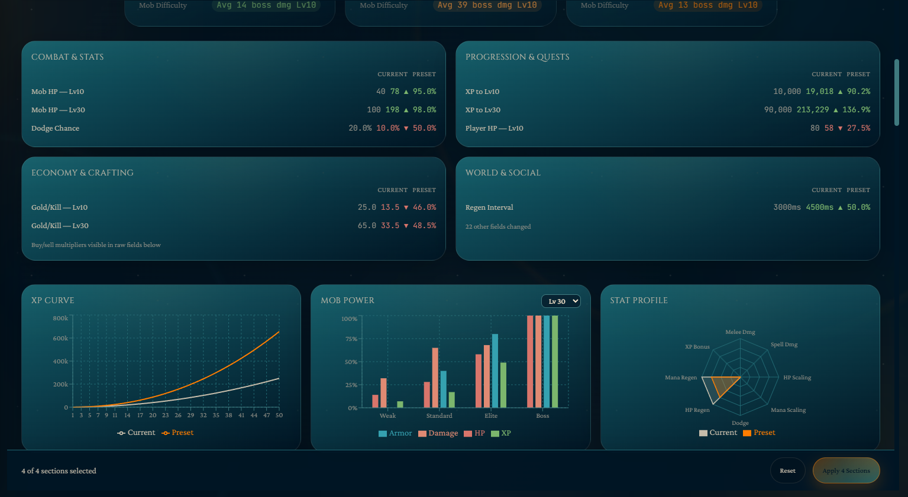 
  <em>Tuning wizard — before/after comparison with XP curves, stat profiles, and per-category accept/reject</em>

  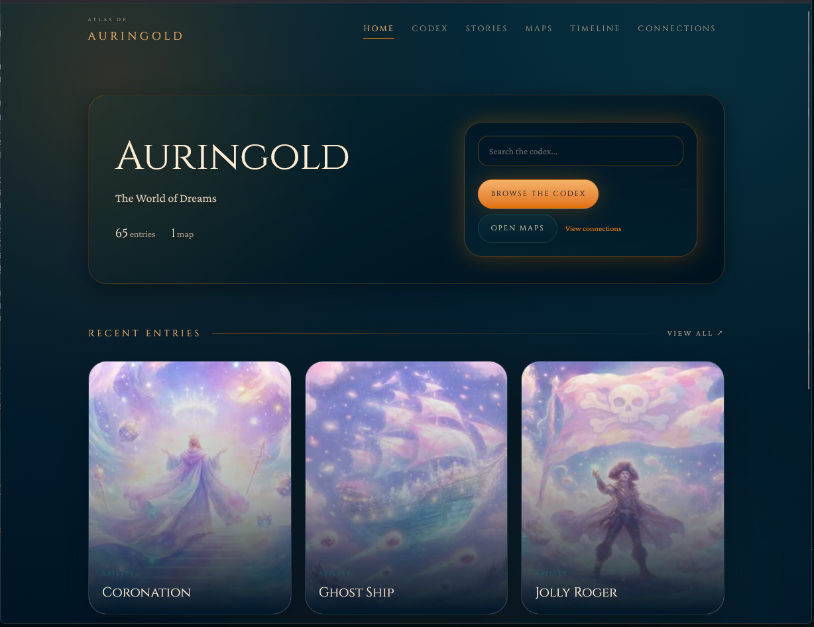 
  <em>Published showcase — one-click deploy to a public read-only website</em>

## What you can build

### Worldbuilding & lore

- **Articles** built on a rich-text editor, with 11 built-in templates (character, location, organization, species, event, language, profession, ability, item, world setting, freeform) plus your own custom templates. @mention any other article to link them.
- **Interactive maps** — upload an image, drop colored pins linked to articles, and optionally let Claude vision analyze the map for you.
- **Timeline** — calendar systems with named eras and importance-weighted events. AI can infer the timeline from article content.
- **Relationship graph** — every @mention and explicit relation (allies, rivals, parent/child, affiliations) becomes an edge in an auto-laid-out visualization.
- **Quality tools** — a consistency auditor, gap analysis, @mention suggestions, and directed "rewrite with instructions" that can change content and fields at once.
- **Bulk editing** — multi-select articles to retag, reparent, change template, or toggle draft/publish, all with undo.
- **Import / export** — bring in an Obsidian vault, export the whole world as a Lore Bible in Markdown or PDF.

### Game worlds & zone building

- **Zone map editor** — a visual room graph with AI-generated backgrounds, entity sprites on each room, visible exit handles, and auto-layout.
- **Entity editors** for mobs, items, shops, quests, gathering nodes, recipes, dialogue trees, and room features.
- **Layout Doctor** — detects and fixes broken exit wiring or text mismatches across a zone.
- **In-editor playtest walker** — step through a zone as a player would, right inside Arcanum, without starting a server.
- **Validation** — inline errors for zone-level, cross-zone, and config problems, mirroring the rules the game server would enforce.

### Game-system design

- **Structured editors** for every game system: stats, abilities, status effects, combat, classes, races, progression, economy, crafting, housing, factions, weather, and more.
- **Tuning wizard** — themed presets with a before/after diff across categories, and a **balance simulation lab** that models XP curves, encounter outcomes, and progression pacing so you can see the effect of a change before committing it.
- **World Planner** — a top-down planning tab inside the Maps panel for sketching how zones, factions, and arcs fit together before you build them.
- **Raw YAML fallback** for any field the structured editors don't cover.

### Art generation (Full Edition)

- **AI image generation** through DeepInfra (FLUX), Runware, or OpenAI (GPT Image 1.5), or through the Arcanum Hub proxy.
- **World-defined visual style** — every project declares its own art style, and that style is folded into the prompt for every generated image so your world stays visually coherent.
- **Dedicated studios** for portraits, ability icons, zone backgrounds, sprites, housing interiors, and AI-illustrated zone maps generated from their actual room data.
- **Live-preview showcase settings** — tune your published site's art and hero imagery with an AI art generator that previews the result in-place.
- **Asset gallery** with type/zone filters, variant grouping, and one-click Cloudflare R2 sync for serving images from your own CDN.

### Publishing

- **One-click showcase** — publish your world as a read-only public website. Host it yourself, or publish to `yourworld.arcanum-hub.com` for free via the Arcanum Hub.
- **Hub discovery** — listed worlds get rich cards, Open Graph previews, and full-text search on the hub landing page.
- **Content updates** require no rebuild — the showcase fetches your world's data at runtime, so republishing is instant.

### Quality-of-life

- **Offline backup** — every project autosaves, snapshots itself periodically, and can be exported as a zip archive at any time.
- **Unified undo/redo** across zones, lore articles, stories, and config — one Ctrl+Z everywhere.
- **Command palette** (Ctrl+K) — fuzzy jump to any article, panel, zone, or cross-zone entity.
- **Full-text search** across articles, fields, tags, and private notes.
- **Getting-started checklist** that adapts as you use the tool, so you don't have to memorize the feature map.

## Arcanum Hub

The Hub is optional infrastructure for Arcanum users who'd rather not manage their own AI provider accounts or publishing host.

- **AI proxy** — one key routes image generation, LLM writing, and vision analysis through the Hub's providers. Turn it on with a checkbox in settings; the rest of the app doesn't need to know.
- **Free public hosting** — publish to `yourworld.arcanum-hub.com` with a single click. The Hub serves your showcase and its images from its own CDN.
- **World directory** — the Hub landing page lets anyone discover published worlds with rich previews and search.

If you'd rather self-host your showcase on your own Cloudflare R2 bucket and bring your own AI keys, Arcanum supports that too — the Hub is a convenience, not a lock-in.

## License

Arcanum is licensed under the [PolyForm Noncommercial License 1.0.0](LICENSE.md). Personal projects, hobby use, research, education, and nonprofit work are all welcome. Commercial use is **not** permitted under this license — open an issue on the repository to discuss commercial terms.

## Contributing & documentation

Arcanum is open source and contributions are welcome.

- **[Developer Guide](docs/DEVELOPER_GUIDE.md)** — setting up a dev environment, building from source, the repository layout, dev workflow, tech stack, CI, and everything else a contributor needs.
- **[Arcanum Style Guide](ARCANUM_STYLE_GUIDE.md)** — the design system (palette, typography, motion, components) if you're contributing UI.
- **[Hub worker](hub-worker/README.md)** — if you're working on Hub infrastructure.

For bug reports or feature requests, please [open an issue](https://github.com/jnoecker/AmbonArcanum/issues).
