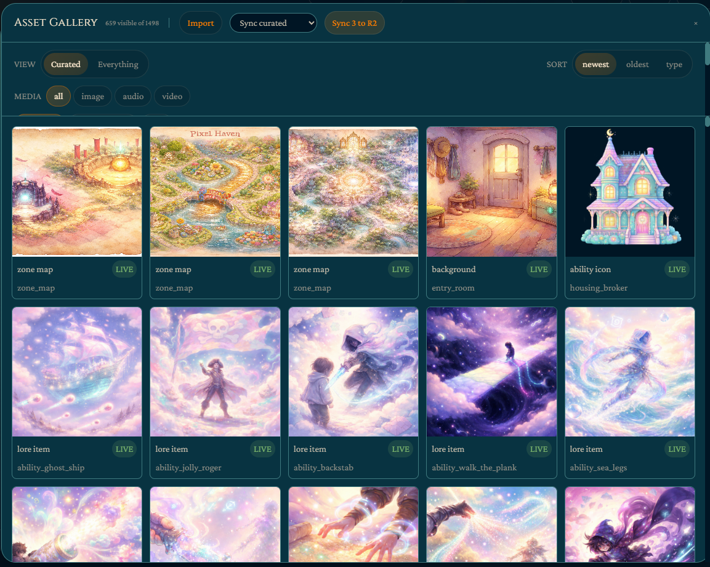

# Arcanum

A desktop tool for building fictional worlds — lore, maps, timelines, relationship graphs, AI-generated art, MUD zone maps, and a one-click public showcase site.

Arcanum started as the creator tool for [AmbonMUD](https://github.com/jnoecker/AmbonMUD), but its worldbuilding features work for any setting: tabletop RPGs, novels, video-game bibles, or worldbuilding for its own sake. It can ship worlds as read-only public websites, either self-hosted or through the optional [Arcanum Hub](#arcanum-hub).

Built with Tauri 2 (Rust backend, React 19 frontend). Windows-first, cross-platform releases.

## Screenshots

<p align="center">
  
  <br>
  <em>Navigate between realms — each floating island is a major feature area</em>
</p>

<table>
  <tr>
    <td align="center" width="33%">
      <br>
      <strong>The Arcanum</strong><br>
      <sub>Articles, maps, timeline, relations, story editor</sub>
    </td>
    <td align="center" width="33%">
      <br>
      <strong>The Loom</strong><br>
      <sub>Classes, races, abilities, stats, equipment</sub>
    </td>
    <td align="center" width="33%">
      <br>
      <strong>The Forge</strong><br>
      <sub>AI art generation, portraits, icons, sprites</sub>
    </td>
  </tr>
  <tr>
    <td align="center">
      <br>
      <strong>The Orrery</strong><br>
      <sub>Economy, crafting, housing, factions, tuning</sub>
    </td>
    <td align="center">
      <br>
      <strong>The Living World</strong><br>
      <sub>Events, emotes, gardening, mounts, nature</sub>
    </td>
    <td align="center">
      <br>
      <strong>The Spire</strong><br>
      <sub>Server control, deployment, admin, settings</sub>
    </td>
  </tr>
</table>

<p align="center">
  <br>
  <em>Zone map editor — room graph with AI-generated backgrounds, entity sprites, and exit handles</em>
</p>

<p align="center">
  <br>
  <em>Asset gallery — curated view with R2 sync, type filters, and batch management</em>
</p>

<p align="center">
  <br>
  <em>Article editor — template fields, rich text with @mentions, and AI rewrite tools</em>
</p>

<table>
  <tr>
    <td align="center" width="33%">
      <br>
      <strong>Interactive Maps</strong><br>
      <sub>Colored pins linked to lore articles, AI analysis</sub>
    </td>
    <td align="center" width="33%">
      <br>
      <strong>Timeline</strong><br>
      <sub>Eras, importance-weighted events, AI inference</sub>
    </td>
    <td align="center" width="33%">
      <br>
      <strong>Relationship Graph</strong><br>
      <sub>Connections between articles with template and type filters</sub>
    </td>
  </tr>
</table>

<p align="center">
  <br>
  <em>Tuning wizard — before/after comparison with XP curves, stat profiles, and per-category accept/reject</em>
</p>

<p align="center">
  <br>
  <em>Published showcase — one-click deploy to a public read-only website</em>
</p>

## Repository layout

| Directory | What it is |
|---|---|
| `creator/` | The Arcanum desktop app — Tauri shell, React frontend, Rust backend |
| `showcase/` | The public showcase SPA (Vite + React). Runs in three modes: self-hosted, Arcanum Hub landing, and per-world hub subdomain |
| `hub-worker/` | Cloudflare Worker backing the central Arcanum Hub — publish API, admin API, AI proxy, and the multi-tenant showcase assets |
| `hub-admin/` | Small React SPA for hub user/quota management, deployed to Cloudflare Pages |
| `docs/` | Developer documentation (see [`docs/DEVELOPER_GUIDE.md`](docs/DEVELOPER_GUIDE.md)) |

## Quick start

```bash
cd creator
bun install
bun run tauri dev
```

A Tauri window opens against the Vite dev server at `localhost:1420`. The full setup walkthrough — including Rust toolchain, WebView2, showcase, and hub subprojects — is in [`docs/DEVELOPER_GUIDE.md`](docs/DEVELOPER_GUIDE.md).

## What's in the box

### Worldbuilding & lore
- **Articles** built on TipTap with 11 built-in templates (character, location, organization, species, event, language, profession, ability, item, world setting, freeform) plus user-defined custom templates. Rich text, @mentions, template-specific fields, and multi-image galleries per article.
- **Interactive maps** — upload map images, place colored pins linked to articles, AI map analysis via Claude vision.
- **Timeline** — calendar systems with eras, importance-weighted events, AI inference from article content.
- **Relationship graph** — React Flow visualization of @mention edges and structured relations (affiliations, allies, rivals, parent hierarchy) with dagre auto-layout.
- **Quality tools** — consistency auditor, gap analysis, @mention suggestions, rewrite-with-instructions (directed AI rewrite of content + fields).
- **Bulk operations** — multi-select, batch retag, reparent, template change, draft/publish toggle, with undo.
- **Import / export** — Obsidian/Markdown vault import wizard, Lore Bible export to Markdown and PDF.
- **Showcase publishing** — one-click publish to a read-only public website.

### MUD zone building
- **Zone map editor** — React Flow graph with custom room nodes, dagre auto-layout, cross-zone exit navigation.
- **Entity editors** for mobs, items, shops, quests, gathering nodes, recipes, dialogue trees, and room features.
- **YAML round-trip** — format-preserving read/write via the `yaml` package CST mode, so existing comments and field ordering survive edits.
- **Validation engine** — zone-level, cross-zone, and config validation with inline errors, mirroring server-side `WorldLoader.kt` rules.

### Game-system configuration
- **Structured editors** for every `application.yaml` section: stats, abilities, status effects, combat, classes, races, progression, economy, crafting, housing, factions, weather, and more.
- **Tuning wizard** — themed presets with before/after comparison across categories, per-category accept/reject.
- **Raw YAML fallback** for any config field the structured editors don't cover.
- **Per-project settings** — art pipeline, R2 credentials, and generation config stored under `<project>/.arcanum/settings.json`. API keys stay user-level in `~/.tauri/settings.json`.

### Art generation
- **AI image generation** via DeepInfra (FLUX), Runware, or OpenAI (GPT Image 1.5).
- **World-defined visual style** — projects declare a `visualStyle` that drives every generated image's tone, injected into prompts after LLM enhancement.
- **Two built-in reference styles** — Arcanum (baroque cosmic ember-tide) and Gentle Magic (soft dreamlike lavender).
- **Asset gallery** with content-addressed storage (SHA-256 filenames), lazy thumbnails, type/zone filters, variant grouping.
- **Cloudflare R2 sync** — AWS SigV4 uploads with custom-domain CDN.
- **Portrait and ability icon studios**, batch zone art, music/video generation.

### Developer experience
- **Undo/redo** — zone stacks via zundo (100 entries), lore history stacks (50 entries), context-aware Ctrl+Z.
- **Command palette** (Ctrl+K) — fuzzy jump to any article, panel, or zone.
- **Full-text search** across articles, fields, tags, and private notes.
- **Diff view before save** shows exactly which YAML bytes will be written.
- **Keyboard shortcuts** — Ctrl+S, Ctrl+Z, Ctrl+K, `?` for help.

## Showcase

The `showcase/` SPA is a standalone Vite + React 19 + Tailwind 4 read-only viewer for published worlds. It runs in three modes selected at runtime from the hostname:

| Mode | Hostname | Data source |
|---|---|---|
| Self-hosted | your own domain (e.g. `lore.ambon.dev`) | `showcase.json` uploaded to your R2 bucket |
| Hub root | `arcanum-hub.com` | `/api/index` — world directory landing page |
| Hub world | `<slug>.arcanum-hub.com` | `showcase.json` from R2, resolved by the Worker via Host header |

Publishing flow: click **Publish Lore** in the creator toolbar → `exportShowcaseData()` converts `WorldLore` to `ShowcaseData` (TipTap JSON → HTML, relations merged, images resolved) → upload to R2 via the `deploy_showcase_to_r2` or `publish_to_hub` Rust command. The showcase fetches the JSON at runtime — no rebuild required after the initial deploy.

Showcase pages: Home, Codex (template-grouped article browser), Article detail (rich text + relations + image gallery), Maps (pinned image viewer), Timeline (era-grouped), Connections (relationship graph).

## Arcanum Hub

The `hub-worker/` directory hosts an optional Cloudflare Worker that provides:

- **Publish API** — bearer-auth upload for `showcase.json` + content-addressed WebP images (D1 users table, R2 `arcanum-hub` bucket).
- **Admin API** — master-key endpoints for user/quota/world management, consumed by `hub-admin/`.
- **AI proxy** — `/ai/image/generate` (Runware FLUX.2 / GPT Image 1.5), `/ai/llm/complete` (OpenRouter DeepSeek V3.2), `/ai/llm/vision` (Claude Sonnet 4.6), with per-user lifetime quotas enforced server-side.
- **Multi-tenant showcase hosting** — serves the showcase SPA via a Worker `[assets]` binding and resolves per-world data from the Host header.

The creator can route all AI calls through the hub by enabling `settings.use_hub_ai` — the existing provider commands short-circuit through `hub_ai::is_enabled(&settings)`, so the frontend is unaware of the mode switch.

See [`hub-worker/README.md`](hub-worker/README.md) for the hub architecture and setup.

## Tech stack

| Layer | Technology |
|---|---|
| Desktop shell | Tauri 2 (WebView2 on Windows) |
| Frontend | React 19, TypeScript 5.8, Vite 6, Tailwind CSS 4 |
| State | Zustand 5 + zundo (undo/redo middleware) |
| Graphs | XY Flow (React Flow) + dagre |
| Rich text | TipTap 3 |
| Maps | Leaflet 1.9 + react-leaflet 5 (CRS.Simple) |
| YAML | `yaml` ^2.7 (CST mode) |
| Backend | Rust 2021 edition, Tokio, `reqwest`, `image`, `webp`, `ffmpeg-sidecar` |
| Asset CDN | Cloudflare R2 (S3-compatible, AWS SigV4 signing — no SDK) |
| Image generation | DeepInfra, Runware, OpenAI |
| LLM | Anthropic Claude, OpenRouter |
| Testing | Vitest (data-layer only) |
| Package managers | Bun (creator), npm (showcase / hub-worker / hub-admin) |
| Fonts | Cinzel, Crimson Pro, JetBrains Mono (via Fontsource) |

## Development commands

```bash
# Creator (Tauri app)
cd creator
bun install
bun run tauri dev           # Vite dev server + Tauri window
bunx tsc --noEmit           # Type check
bun run test                # Vitest data-layer tests
cd src-tauri && cargo check # Rust check
bun run tauri build         # Production bundle

# Showcase (public SPA)
cd showcase
npm install
npm run dev
npm run typecheck
npm run build
npx wrangler pages deploy dist --project-name=ambon-showcase  # Self-hosted deploy

# Hub worker (optional)
cd hub-worker
npm install
npm run dev                 # wrangler dev on :8787
npm run deploy              # Rebuilds showcase with hub env var, then wrangler deploy

# Hub admin (optional)
cd hub-admin
npm install
VITE_HUB_API_URL=https://api.arcanum-hub.com npm run build
npx wrangler pages deploy dist --project-name=arcanum-hub-admin --branch=main
```

## CI/CD

GitHub Actions in `.github/workflows/`:

- **`ci.yml`** — runs on PRs and pushes to `main`. Creator: `bun install --frozen-lockfile`, `tsc --noEmit`, `vitest run`, `cargo check`. Showcase: `npm ci`, `npm run typecheck`, `npm run build`. Does not currently check `hub-worker` or `hub-admin`.
- **`release.yml`** — triggered by `v*` tags or manual dispatch. Builds Windows, macOS Universal (aarch64 + x86_64), and Linux installers via `tauri-action`, attaches them to a draft GitHub release, then publishes it.

## Design system

Dark-only. Deep midnight-teal backgrounds, hearth-ember warm accents, parchment-ivory text. All serif — Cinzel for display, Crimson Pro for body, JetBrains Mono for code. Design tokens live in `creator/src/index.css` (`@theme` block + `:root` custom properties) and are consumed through semantic Tailwind utilities (`bg-bg-primary`, `text-accent`, etc.).

See [`ARCANUM_STYLE_GUIDE.md`](ARCANUM_STYLE_GUIDE.md) for the full palette, typography hierarchy, component specs, and art prompts. [`.impeccable.md`](.impeccable.md) has the condensed version used as AI design context.

## Documentation

- [`docs/DEVELOPER_GUIDE.md`](docs/DEVELOPER_GUIDE.md) — full setup walkthrough, dev workflow, architecture map, troubleshooting
- [`CLAUDE.md`](CLAUDE.md) — architecture, coding conventions, and known pitfalls (also used as AI-assistant context)
- [`ARCANUM_STYLE_GUIDE.md`](ARCANUM_STYLE_GUIDE.md) — design system source of truth
- [`.impeccable.md`](.impeccable.md) — condensed design context
- [`hub-worker/README.md`](hub-worker/README.md) — hub architecture and deployment

## License

Arcanum is licensed under the [PolyForm Noncommercial License 1.0.0](LICENSE.md). Personal projects, hobby use, research, education, and nonprofit work are all welcome. Commercial use is **not** permitted under this license — open an issue on the repository to discuss commercial terms.
